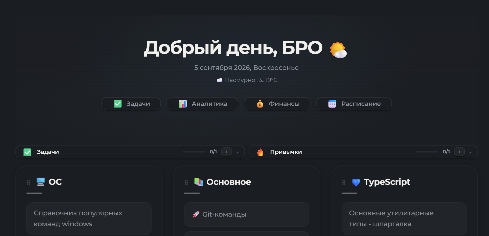

# WorkLife Calendar for Obsidian

> **All-in-one:** smart calendar, task and habit tracker, time tracking, and financial planner — connected into a single ecosystem inside Obsidian.

<div align="center">

[](https://opensource.org/licenses/MIT)
[](https://obsidian.md)
[](https://svelte.dev/)
[](https://www.typescriptlang.org/)

</div>

---


[**English README**](https://github.com/AtinsS/WorkLife-Calendar-for-Obsidian/blob/master/README.md)

## 💡 Why this plugin exists

Many workflows share the same problem: tasks live in one place, the calendar in another, time tracking in a third, and finances and reports are collected manually in spreadsheets. As a result, the same data has to be entered several times.

**This plugin solves exactly that problem.** It doesn't just add another calendar or tracker. It connects planning, execution, and analysis into one system:
- One task affects the calendar.
- The calendar affects time tracking.
- Time affects income calculation.
- Income generates automatic analytics.
- **Mobile experience:** working with tasks from your phone in Obsidian without unnecessary pain.

---

## 🚀 Who it's for

- **Freelancers and developers** who need to calculate the cost of work by rate.
- **Designers and consultants** managing several projects simultaneously.
- **Students and researchers** who need to link deadlines, habits, and productivity.
- **Automation enthusiasts** who want the system to work for them (notifications, reports).

---

## ⚙️ Main Workflow

```text
Project 
  ↓
Task (with time estimate and rate)
  ↓
Calendar / Schedule (slot planning)
  ↓
Time tracking (actual vs planned)
  ↓
Income and expenses (auto-calculation)
  ↓
Analytics (charts and reports)
```

---

## 📦 Installation

### Via BRAT (Recommended)
1. Install the [BRAT](https://github.com/TfTHacker/obsidian42-brat) plugin.
2. Open BRAT settings → **Add Beta Plugin**.
3. Paste the link: `https://github.com/AtinsS/obsidian-calendar-plugin-remastered`
4. Click **Add Plugin**.

### Manually
1. Download the archive or clone the repository.
2. Copy `main.js`, `manifest.json`, and `styles.css`.
3. Place them into the folder `.obsidian/plugins/calendar-plugin-remastered/` (create it if it doesn't exist).
4. Enable the plugin in *Settings → Community plugins*.

---

## ☕ Support

If the plugin saves your time and helps with your work, you can support the development:
- ⭐ Star the repository.
- [☕ Buy the author a coffee with a bun](https://boosty.to/atins/donate).

---

<details>
<summary><h3>✨ Detailed Features (expand)</h3></summary>

### 📅 Calendar and Schedule
- Full view (day / week / month) based on the **FullCalendar** library with drag & drop support.
- Visual indicators of tasks and habits directly in the calendar grid.
- Create tasks by clicking and change time by dragging.
- **Weather** for each day of the week (Open-Meteo API, no keys) for the visible date range.
- Adaptive mobile schedule for small screens.

### ✅ Tasks and Time Management
- **4 statuses:** *To Do* → *In Progress* → *Paused* → *Done*.
- **Quick task addition** — `Ctrl+Alt+N` from anywhere in Obsidian opens a smart input window. Supports natural language parsing with color highlighting:
  - Project `@Work 14-15 meeting`
  - Time: `14:00 buy milk`, `14-15 meeting`, `from 16:00 to 18:00 meeting`
  - Date: `tomorrow buy milk`, `Friday report`, `25.07 meeting`, `+3 task`
  - Priority: `! urgent`, `~ medium`, `- low`
  - Date and time work in any position: `tomorrow at 14:00 buy milk` or `buy milk tomorrow at 14:00`
  - `Enter` opens the advanced editor with pre-filled data, or the `⋯` button
- **Kanban board** — visual task management with 4 columns (To Do / In Progress / Paused / Done):
  - Drag & drop tasks between columns to change status
  - Create tasks directly in the "To Do" column
  - Informative cards with project color, time, deadline, priority, work task badge, recurrence, note link, and live timer
  - Date filters: Today / All / Specific date / Project
  - Right-click context menu for editing and deleting
- **Recurring tasks:** daily / weekly / monthly with customizable interval.
- **Projects:** group tasks with color labeling.
- **Timer:** built-in time tracking with auto-resume on Obsidian restart. Live timer on Kanban cards with pause indication.
- **Checklists:** a checklist can be created for each task.
- **Deadlines and estimates:** comparison of planned and actual time, notifications about approaching deadlines.
- **Two-way synchronization** with the [Tasks](https://github.com/obsidian-tasks-group/obsidian-tasks) and [Dataview](https://github.com/blacksmithgu/obsidian-dataview) plugins via regular `.md` files.

### 🔄 Habit Tracker
- Flexible frequency (days of the week, day of the month).
- Quantitative goals for each habit.
- Streak counting and visual indicators on the calendar.
- **Display modes** — choose where to show habits: in the task panel (default), as a separate tab, or hidden. Setting: Settings → General → "Habits mode".
- **Full CRUD** — create, edit, delete habits from the habits panel and from the dashboard.

### 💰 Finance and Analytics
- **Income:** automatic calculation from the rate of work tasks or manual entry.
- **Budget:** expense categories with icons and distribution rules.
- **Savings:** goals with completion percentage.
- **Analytics:** bar and pie charts by project, income/expense dynamics by month, plan vs actual comparison.

### 🎨 Appearance and UI
- Customizable accent color.
- Glass panels (glassmorphism) with customizable background and transparency.
- **Info panel** under the tabs (date, time, weather, tasks) with display settings.
- **Dashboard** for quick access to notes, with task and habit management (create, edit, delete).

### 🌍 Localization and Language
- **Two languages:** Russian and English. Switch in the plugin settings.
- **System language** — automatic OS language detection.
- **Week start** — set the first day of the week (Monday / Sunday / by language). Affects the calendar, schedule, creation of recurring tasks and habits.
- All strings are translated: interface, settings, notifications, weather, analytics.

### ⛅ Weather Viewing
- **Weather tab** — opens from the sidebar when selecting a day.
- **Weather in week view** — makes planning the week easier.
- **Provider selection** — in the settings you can connect your preferred provider (available: Open-Meteo, OpenWeatherMap, WeatherApi, Visual Crossing)
 
</details>

<details>
<summary><h3>🔗 Synchronization and Integrations (expand)</h3></summary>

### New data storage format
The plugin can store data in JSON format in the `calendar-data/` folder at the vault root. When the "Sync to vault root" feature is enabled, it becomes the primary data storage format, providing fast loading and data synchronization via:
- **WebDAV** (Yandex.Disk, OneDrive, etc.)
- **Obsidian Sync** / **Remotely Save**
- **iCloud** / **Google Drive**
- **Syncthing**

> [!WARNING] Financial data
> If you keep financial records in the plugin and use cloud synchronization, income and expense data will be stored in plain text in the cloud. It is recommended to use abstract project names or exclude the `calendar-data/` folder from synchronization.

### External calendars (Git synchronization required)
1. Create a [GitHub Personal Access Token](https://github.com/settings/tokens) (classic) with the `gist` scope.
2. Paste the token into the plugin settings and click **"Sync"**.
3. The plugin will create a Gist with an `.ics` file and provide a link.
4. Add this link to your calendar via the "Subscribe by URL" feature.

### Tasks format integration (optional)
When the "Tasks plugin sync" setting is enabled, the plugin creates `.md` files for tasks so they are visible in the Tasks and Dataview plugins. This is an **additional** feature — the main storage remains in JSON. Example of a generated file:
```markdown
---
task_id: abc123
title: Buy milk
status: todo
date: day-2024-10-25
priority: medium
---
- [ ] Buy milk 📅 2024-10-25 🛫 14:30 🔼
```
*(Supported statuses: `- [ ]` todo, `- [/]` progress, `- [-]` paused, `- [x]` done)*

> [!NOTE]
> Optional synchronization with `.md` files (via the "Tasks plugin sync" setting) is intended for compatibility with the [Tasks](https://github.com/obsidian-tasks-group/obsidian-tasks) and [Dataview](https://github.com/blacksmithgu/obsidian-dataview) plugins.

</details>

<details>
<summary><h3>🔔 Notifications (expand)</h3></summary>

The plugin has a built-in notification system so you don't miss anything important.

| Type | When it triggers |
| :--- | :--- |
| **Local (browser)** | N minutes before start, on overdue, when time limit exceeded, on deadline day. |
| **To smartphone (ntfy.sh)** | Duplicate notifications to your phone. Works even when Obsidian is closed. |

### Setting up ntfy.sh

A simple way to receive notifications on your phone:
1. Install the [ntfy.sh](https://ntfy.sh/) app on your phone.
2. In the plugin settings, enable **ntfy.sh** and set a topic.
3. Subscribe to that topic in the app.

> [!CAUTION] Security
> Use a unique topic (e.g., a generated UUID like `a7f9b2c4-8e1d-4f3a-9c5b-2d6e8f0a1b3c`) so no one else can subscribe to your notifications. The plugin sends only triggers ("Overdue: Task name"), not financial data or full texts.

</details>

<details>
<summary><h3>🧭 UI Widgets in Notes (expand)</h3></summary>

Insert a code block into any note to create a quick navigation panel for the plugin sections:

````markdown
```calendar-nav
schedule:Schedule
tasks:Tasks
finance:Finance
analytics:Analytics
```
````
Available keys: `schedule`, `tasks`, `finance`, `analytics`.

**Style customization** (first line starts with `%`):
````markdown
```calendar-nav
%color:#fff;bg:#333;radius:20px;size:14px;accent:#5f99e1
schedule:Schedule
tasks:Tasks
```
````
Style parameters: `color` (text), `bg` (background), `radius` (border radius), `size` (font size), `accent` (hover color).

### Dashboard and greeting

Right-click on a page and select "Add Dashboard" or "Add greeting" to create a new dashboard or greeting on the page.


</details>

---

## 🐛 Issues and Bug Reports

Found a bug or have a feature suggestion? Open an issue on GitHub:

**[Open Issue](https://github.com/AtinsS/WorkLife-Calendar-for-Obsidian/issues)**

When reporting a bug, please include:
- Obsidian version
- Plugin version
- Steps to reproduce
- Expected and actual behavior
- Console errors (if any): *Ctrl+Shift+I → Console tab*

---

<div align="center">
  <sub>Developed with attention to detail for the Obsidian community</sub><br>
  <sub>Author: <a href="https://github.com/AtinsS">@AtinsS</a></sub><br>
  <sub>License: <a href="https://opensource.org/licenses/MIT">MIT</a></sub>
</div>