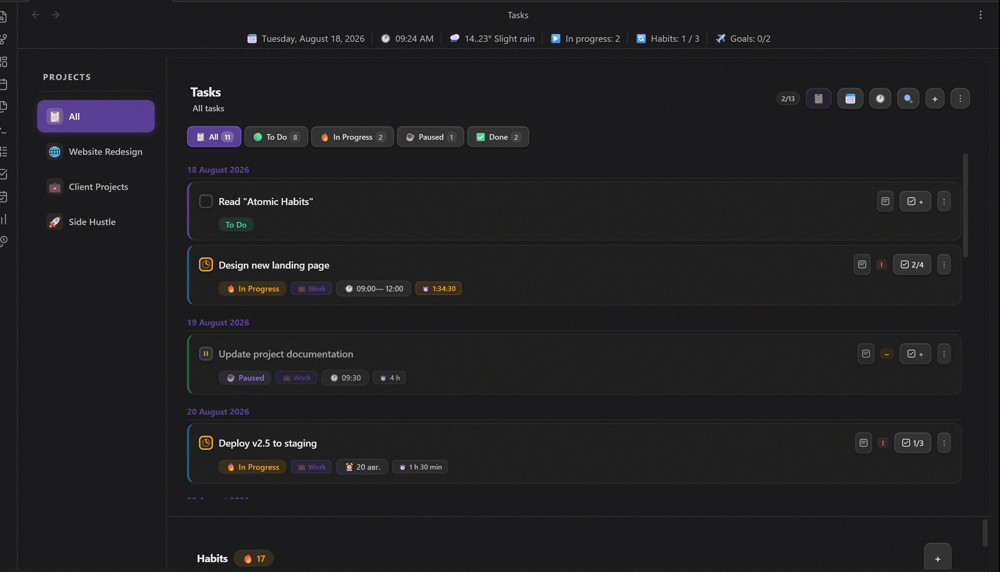

# WorkLife Calendar for Obsidian

> **All-in-one:** a smart calendar, task and habit tracker, time tracker, and financial planner, all connected into a single ecosystem within Obsidian.

<div align="center">

[](https://opensource.org/licenses/MIT)
[](https://obsidian.md)
[](https://svelte.dev/)
[](https://www.typescriptlang.org/)

</div>

---



[**Russian README**](https://github.com/AtinsS/WorkLife-Calendar-for-Obsidian/blob/master/README.RU.md)

## 💡 Why this plugin exists

Many workflows share the same problem: tasks live in one place, the calendar in another, time tracking in a third, and finances and reports are compiled manually in spreadsheets. As a result, the same data has to be entered multiple times.

**This plugin solves exactly that pain point.** It doesn't just add another calendar or tracker. It connects planning, execution, and analysis into a single system:
- A single task updates the calendar.
- The calendar drives time tracking.
- Time spent calculates income.
- Income generates automatic analytics.
- **Mobile experience:** work with tasks from your phone in Obsidian without the usual friction.

---

## 🚀 Who is this for

- **Freelancers and developers** who need to calculate work costs based on hourly rates.
- **Designers and consultants** managing multiple projects simultaneously.
- **Students and researchers** who need to link deadlines, habits, and productivity.
- **Automation enthusiasts** who want the system to work for them (notifications, reports).

---

## ⚙️ Main Workflow

```text
Project 
  ↓
Task (with time estimate and hourly rate)
  ↓
Calendar / Schedule (slot planning)
  ↓
Time Tracking (actual vs planned)
  ↓
Income and Expenses (auto-calculated)
  ↓
Analytics (charts and reports)
```

---

## 📦 Installation

### Via BRAT (Recommended)
1. Install the [BRAT](https://github.com/TfTHacker/obsidian42-brat) plugin.
2. Open BRAT settings → **Add Beta Plugin**.
3. Paste the link: `https://github.com/AtinsS/obsidian-calendar-plugin-remastered`
4. Click **Add Plugin**.

### Manual Installation
1. Download the archive or clone the repository.
2. Copy `main.js`, `manifest.json`, and `styles.css`.
3. Place them in the `.obsidian/plugins/calendar-plugin-remastered/` folder (create it if it doesn't exist).
4. Enable the plugin in *Settings → Community plugins*.

---

## ☕ Support

If this plugin saves you time and helps with your work, you can support its development:
- ⭐ Star the repository.
- [☕ Buy the author a coffee and a pastry](https://boosty.to/atins/donate).

---

<details>
<summary><h3>✨ Detailed Features (click to expand)</h3></summary>

### 📅 Calendar and Schedule
- Full view (day / week / month) based on the **FullCalendar** library with drag & drop support.
- Visual indicators for tasks and habits directly in the calendar grid.
- Create tasks with a click and change times by dragging.
- **Weather** for each day of the week (Open-Meteo API, no keys required) for the visible date range.
- Adaptive mobile schedule for small screens.

### ✅ Tasks and Time Management
- **4 statuses:** *To Do* → *In Progress* → *Paused* → *Done*.
- **Quick task creation** — `Ctrl+Alt+N` from anywhere in Obsidian opens a smart input dialog. Supports natural language parsing with color-highlighted preview:
  - Time: `14:00 buy milk`, `14-15 meeting`, `from 16:00 to 18:00 meeting`
  - Date: `tomorrow buy milk`, `friday report`, `25.07 meeting`, `+3 task`
  - Priority: `! urgent`, `~ medium`, `- low`
  - Date and time work at any position: `tomorrow at 14:00 buy milk` or `buy milk tomorrow at 14:00`
  - Press `Enter` to open the full task editor with pre-filled data, or use the `⋯` button
- **Kanban Board** — visual task management with 4 columns (To Do / In Progress / Paused / Done):
  - Drag & drop tasks between columns to change status
  - Create tasks directly in the "To Do" column
  - Rich task cards with project color, time, deadline, priority, work badge, recurrence, note link, and live timer
  - Date filters: Today / All / Specific date
  - Right-click context menu for editing and deleting
- **Recurring tasks:** daily / weekly / monthly with customizable intervals.
- **Projects:** task grouping with color coding.
- **Timer:** built-in time tracking with auto-resume on Obsidian restart. Live timer on Kanban cards with pause indication.
- **Checklists:** create a checklist for each task.
- **Deadlines and estimates:** compare planned and actual time, notifications for approaching deadlines.
- **Two-way sync** with the [Tasks](https://github.com/obsidian-tasks-group/obsidian-tasks) and [Dataview](https://github.com/blacksmithgu/obsidian-dataview) plugins via standard `.md` files.

### 🔄 Habit Tracker
- Flexible frequency (days of the week, day of the month).
- Quantitative goals for each habit.
- Streak counting and visual indicators on the calendar.
- **Display modes** — choose where habits appear: in the task panel (default), as a separate tab, or hidden. Configure in Settings → General → "Habits mode".
- **Full CRUD** — create, edit, delete habits from the habit panel and from the dashboard.

### 💰 Finances and Analytics
- **Income:** automatic calculation based on hourly rates from work tasks or manual entry.
- **Budget:** expense categories with icons and distribution rules.
- **Savings:** goals with completion percentages.
- **Analytics:** bar and pie charts by project, income/expense dynamics by month, planned vs. actual comparisons.

### 🎨 Appearance and UI
- Customizable accent color.
- Glassmorphism panels with customizable background and transparency.
- **Info panel** under the tabs (date, time, weather, tasks) with display settings.
- **Dashboard** for quick access to notes, with inline task and habit management (create, edit, delete).

### 🌍 Localization and Language
- **Two languages:** Russian and English. Switch in the plugin settings.
- **System language** — automatic OS language detection.
- **First day of the week** — customize the start of the week (Monday / Sunday / by language). Affects the calendar, schedule, recurring tasks, and habits creation.
- All strings are translated: interface, settings, notifications, weather, analytics.

</details>

<details>
<summary><h3>🔗 Sync and Integrations (click to expand)</h3></summary>

### New Data Storage Format
The plugin can store data in JSON format in the `calendar-data/` folder at the root of your vault. When "Sync to vault root" is enabled, it becomes the primary data storage format, ensuring fast loading and data sync via:
- **WebDAV** (Yandex.Disk, OneDrive, etc.)
- **Obsidian Sync** / **Remotely Save**
- **iCloud** / **Google Drive**

> [!NOTE]
> Optional sync with `.md` files (via the "Tasks plugin sync" setting) is intended for compatibility with the [Tasks](https://github.com/obsidian-tasks-group/obsidian-tasks) and [Dataview](https://github.com/blacksmithgu/obsidian-dataview) plugins.

> [!WARNING] Financial data
> If you track finances in the plugin and use cloud sync, income and expense data will be stored in plain text in the cloud. It is recommended to use abstract project names or exclude the `calendar-data/` folder from syncing.

### External Calendars (Google Calendar, Apple Calendar)
1. Create a [GitHub Personal Access Token](https://github.com/settings/tokens) (classic) with the `gist` scope.
2. Paste the token into the plugin settings and click **"Sync"**.
3. The plugin will create a Gist with an `.ics` file and provide a link.
4. Add this link to your calendar via the "Subscribe from URL" feature.

### Tasks Plugin Format Integration (Optional)
When the "Tasks plugin sync" setting is enabled, the plugin creates `.md` files for tasks so they are visible in the Tasks and Dataview plugins. This is an **additional** feature — primary storage remains in JSON. Example of a generated file:
```markdown
---
task_id: abc123
title: Buy milk
status: todo
date: day-2024-10-25
priority: medium
---
- [ ] Buy milk 📅 2024-10-25 🛫 14:30 🔼
```
*(Supported statuses: `- [ ]` todo, `- [/]` progress, `- [-]` paused, `- [x]` done)*

</details>

<details>
<summary><h3>🔔 Notifications (click to expand)</h3></summary>

The plugin has a built-in notification system so you don't miss important events.

| Type | When it triggers |
| :--- | :--- |
| **Local (browser)** | N minutes before start, when overdue, when time limit is exceeded, on the deadline day. |
| **To smartphone (ntfy.sh)** | Duplicate notifications to your phone. Works even when Obsidian is closed. |

### Setting up ntfy.sh

A simple way to get notifications on your phone:
1. Install the [ntfy.sh](https://ntfy.sh/) app on your phone.
2. Enable **ntfy.sh** in the plugin settings and set a topic.
3. Subscribe to this topic in the app.

> [!CAUTION] Security
> Use a unique topic (e.g., a generated UUID like `a7f9b2c4-8e1d-4f3a-9c5b-2d6e8f0a1b3c`) so no one else can subscribe to your notifications. The plugin only sends triggers ("Overdue: Task Name"), not financial data or full texts.

</details>

<details>
<summary><h3>🧭 UI Widgets in Notes (click to expand)</h3></summary>

Insert a code block into any note to create a quick navigation panel for the plugin's sections:

````markdown
```calendar-nav
schedule:Schedule
tasks:Tasks
finance:Finance
analytics:Analytics
```
````
Available keys: `schedule`, `tasks`, `finance`, `analytics`.

**Style Customization** (first line starts with `%`):
````markdown
```calendar-nav
%color:#fff;bg:#333;radius:20px;size:14px;accent:#5f99e1
schedule:Schedule
tasks:Tasks
```
````
Style parameters: `color` (text), `bg` (background), `radius` (border radius), `size` (font size), `accent` (hover color).

</details>

---

## 🐛 Issues and Bug Reports

Found a bug or have a feature request? Please open an issue on GitHub:

**[Open an Issue](https://github.com/AtinsS/WorkLife-Calendar-for-Obsidian/issues)**

When reporting a bug, please include:
- Obsidian version
- Plugin version
- Steps to reproduce
- Expected vs actual behavior
- Console errors (if any): *Ctrl+Shift+I → Console tab*

---

<div align="center">
  <sub>Developed with attention to detail for the Obsidian community</sub><br>
  <sub>Author: <a href="https://github.com/AtinsS">@AtinsS</a></sub><br>
  <sub>License: <a href="https://opensource.org/licenses/MIT">MIT</a></sub>
</div>