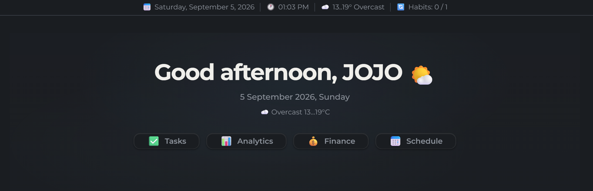

# WorkLife Calendar for Obsidian

> **All-in-One:** a smart calendar, task and habit tracker, time tracking, and financial planner, all connected within a single ecosystem inside Obsidian.

<div align="center">

[](https://opensource.org/licenses/MIT)
[](https://obsidian.md)
[](https://svelte.dev/)
[](https://www.typescriptlang.org/)

</div>

---


[**Русский README**](https://github.com/AtinsS/WorkLife-Calendar-for-Obsidian/blob/master/README.RU.md)

## 💡 Why This Plugin Exists

Many workflows share the same problem: tasks live in one place, the calendar in another, time tracking in a third, and finances and reports are manually compiled in spreadsheets. This means you have to enter the same data multiple times.

**This plugin solves exactly that pain.** It doesn't just add another calendar or tracker. It connects planning, execution, and analysis in one system:
- One task affects the calendar.
- The calendar affects time tracking.
- Time affects income calculation.
- Income generates automatic analytics.
- **Mobile experience:** work with tasks from your phone in Obsidian without extra hassle.

---

## 🚀 Who Is This For

- **Freelancers and developers** who need to calculate work costs based on their rate.
- **Designers and consultants** managing multiple projects simultaneously.
- **Students and researchers** who need to connect deadlines, habits, and productivity.
- **Automation enthusiasts** who want the system to work for them (notifications, reports).

---

## ⚙️ Main Workflow

```text
Project
  ↓
Task (with time estimate and rate)
  ↓
Calendar / Schedule (planning time slots)
  ↓
Time Tracking (actual vs planned)
  ↓
Income and Expenses (auto-calculated)
  ↓
Analytics (charts and reports)
```

---

## 📦 Installation

### Via BRAT (Recommended)
1. Install the [BRAT](https://github.com/TfTHacker/obsidian42-brat) plugin.
2. Open BRAT settings → **Add Beta Plugin**.
3. Paste the link: `https://github.com/AtinsS/obsidian-calendar-plugin-remastered`
4. Click **Add Plugin**.

### Manually
1. Download the archive or clone the repository.
2. Copy `main.js`, `manifest.json`, and `styles.css`.
3. Place them in the `.obsidian/plugins/calendar-plugin-remastered/` folder (create it if it doesn't exist).
4. Enable the plugin in *Settings → Community plugins*.

---

## ☕ Support

If this plugin saves you time and helps you in your work, you can support its development:
- ⭐ Star the repository.
- [☕ Buy the author a coffee and a pastry](https://boosty.to/atins/donate).

---

<details>
<summary><h3>✨ Detailed Features (expand)</h3></summary>

### 📅 Calendar and Schedule
- Full-featured view (day / week / month) based on the **FullCalendar** library with drag & drop support.
- Visual indicators for tasks and habits directly in the calendar grid.
- Create tasks with a click and change time by dragging.
- **Weather** for each day of the week (Open-Meteo API, no API keys required) for the visible date range.
- Adaptive mobile schedule for small screens.

### ✅ Tasks and Time Management
- **4 statuses:** *To Do* → *In Progress* → *Paused* → *Done*.
- **Quick task addition** — `Ctrl+Alt+N` from anywhere in Obsidian opens a smart input window. Supports natural language parsing with color highlighting:
  - Time: `14:00 buy milk`, `14-15 meeting`, `from 16:00 to 18:00 event`
  - Date: `tomorrow buy milk`, `Friday report`, `25.07 meeting`, `+3 task`
  - Priority: `! urgent`, `~ medium`, `- low`
  - Date and time work in any position: `tomorrow at 14:00 buy milk` or `buy milk tomorrow at 14:00`
  - `Enter` opens the extended editor with pre-filled data, or use the `⋯` button
- **Kanban board** — visual task management with 4 columns (To Do / In Progress / Paused / Done):
  - Drag & drop tasks between columns to change status
  - Create tasks directly in the "To Do" column
  - Informative cards with project color, time, deadline, priority, work task badge, recurrence, note link, and live timer
  - Filters by date: Today / All / Specific date / Project
  - Right-click context menu for editing and deleting
- **Recurring tasks:** daily / weekly / monthly with configurable intervals.
- **Projects:** group tasks with color coding.
- **Timer:** built-in time tracking with auto-resume when Obsidian restarts. Live timer on Kanban cards with pause indication.
- **Checklists:** each task can have its own checklist.
- **Deadlines and estimates:** compare planned vs actual time, notifications about approaching deadlines.
- **Two-way synchronization** with the [Tasks](https://github.com/obsidian-tasks-group/obsidian-tasks) and [Dataview](https://github.com/blacksmithgu/obsidian-dataview) plugins via regular `.md` files.

### 🔄 Habit Tracker
- Flexible frequency (days of the week, day of the month).
- Quantitative goals for each habit.
- Streak tracking and visual indicators on the calendar.
- **Display modes** — choose where to show habits: in the task panel (default), as a separate tab, or hide them. Setting: Settings → General → "Habits mode".
- **Full CRUD** — create, edit, and delete habits from the habits panel and from the dashboard.

### 💰 Finance and Analytics
- **Income:** automatic calculation based on the rate from work tasks or manual entry.
- **Budget:** expense categories with icons and allocation rules.
- **Savings:** goals with completion percentage.
- **Analytics:** bar and pie charts by project, income/expense trends by month, planned vs actual comparison.

### 🎨 Appearance and UI
- Customizable accent color.
- Glassmorphism panels with configurable background and transparency.
- **Information panel** under tabs (date, time, weather, tasks) with display settings.
- **Dashboard** for quick access to notes, with task and habit management (create, edit, delete).

### 🌍 Localization and Language
- **Two languages:** Russian and English. Switch in plugin settings.
- **System language** — automatic OS language detection.
- **Week start** — configurable first day of the week (Monday / Sunday / based on language). Affects the calendar, schedule, recurring task creation, and habits.
- All strings are translated: interface, settings, notifications, weather, analytics.

### ⛅ Weather View
- **Weather tab** — opens from the sidebar when you select a day.
- **Weather in the weekly calendar view** — makes weekly planning easier.
- **Provider selection** — In settings, you can connect the provider you prefer (available: Open-Meteo, OpenWeatherMap, WeatherApi, Visual Crossing).

</details>

<details>
<summary><h3>🔗 Sync and Integrations (expand)</h3></summary>

### New Data Storage Format
The plugin can store data in JSON format in the `calendar-data/` folder at the root of your vault. When you enable "Sync to vault root," this becomes the primary data storage format, ensuring fast loading and data synchronization via:
- **WebDAV** (Yandex.Disk, OneDrive, etc.)
- **Obsidian Sync** / **Remotely Save**
- **iCloud** / **Google Drive**

> [!WARNING] Financial Data
> If you track finances in the plugin and use cloud sync, income and expense data will be stored in plain text in the cloud. We recommend using abstract project names or configuring the `calendar-data/` folder to be excluded from sync.

### External Calendars (Requires Git sync)
1. Create a [GitHub Personal Access Token](https://github.com/settings/tokens) (classic) with the `gist` scope.
2. Paste the token into the plugin settings and click **"Sync"**.
3. The plugin will create a Gist with an `.ics` file and provide a link.
4. Add this link to your calendar via the "Subscribe via URL" function.

### Integration with the Tasks Format (optional)
When the "Tasks plugin sync" setting is enabled, the plugin creates `.md` files for tasks so they are visible in the Tasks and Dataview plugins. This is an **additional** feature — the primary storage remains JSON. Example generated file:
```markdown
---
task_id: abc123
title: Buy milk
status: todo
date: day-2024-10-25
priority: medium
---
- [ ] Buy milk 📅 2024-10-25 🛫 14:30 🔼
```
*(Supported statuses: `- [ ]` todo, `- [/]` progress, `- [-]` paused, `- [x]` done)*

> [!NOTE]
> Optional synchronization with `.md` files (via the "Tasks plugin sync" setting) is intended for compatibility with the [Tasks](https://github.com/obsidian-tasks-group/obsidian-tasks) and [Dataview](https://github.com/blacksmithgu/obsidian-dataview) plugins.

</details>

<details>
<summary><h3>🔔 Notifications (expand)</h3></summary>

The plugin has a built-in notification system so you don't miss anything important.

| Type | When triggered |
| :--- | :--- |
| **Local (browser)** | N minutes before the start, when overdue, when time limit is exceeded, on the deadline day. |
| **To smartphone (ntfy.sh)** | Duplicates notifications to your phone. Works even when Obsidian is closed. |

### Setting up ntfy.sh

An easy way to get notifications on your phone:
1. Install the [ntfy.sh](https://ntfy.sh/) app on your phone.
2. In the plugin settings, enable **ntfy.sh** and set a topic.
3. Subscribe to this topic in the app.

> [!CAUTION] Security
> Use a unique topic (e.g., a generated UUID like `a7f9b2c4-8e1d-4f3a-9c5b-2d6e8f0a1b3c`) so no one else can subscribe to your notifications. The plugin only sends triggers ("Overdue: Task name"), not financial data or full text.

</details>

<details>
<summary><h3>🧭 UI Widgets in Notes (expand)</h3></summary>

Insert a code block into any note to create a quick navigation panel for plugin sections:

````markdown
```calendar-nav
schedule:Schedule
tasks:Tasks
finance:Finances
analytics:Analytics
```
````
Available keys: `schedule`, `tasks`, `finance`, `analytics`.

**Style customization** (first line starts with `%`):
````markdown
```calendar-nav
%color:#fff;bg:#333;radius:20px;size:14px;accent:#5f99e1
schedule:Schedule
tasks:Tasks
```
````
Style parameters: `color` (text), `bg` (background), `radius` (border radius), `size` (font size), `accent` (hover color).

### Dashboard and Greeting

Click "Add Dashboard" or "Add Greeting" to create a new dashboard or a greeting on the page.


</details>

---

## 🐛 Issues and Bug Reports

Found a bug or have a feature suggestion? Open an issue on GitHub:

**[Open Issue](https://github.com/AtinsS/WorkLife-Calendar-for-Obsidian/issues)**

When reporting a bug, please include:
- Obsidian version
- Plugin version
- Steps to reproduce
- Expected and actual behavior
- Console errors (if any): *Ctrl+Shift+I → Console tab*

---

<div align="center">
  <sub>Crafted with attention to detail for the Obsidian community</sub><br>
  <sub>Author: <a href="https://github.com/AtinsS">@AtinsS</a></sub><br>
  <sub>License: <a href="https://opensource.org/licenses/MIT">MIT</a></sub>
</div>
