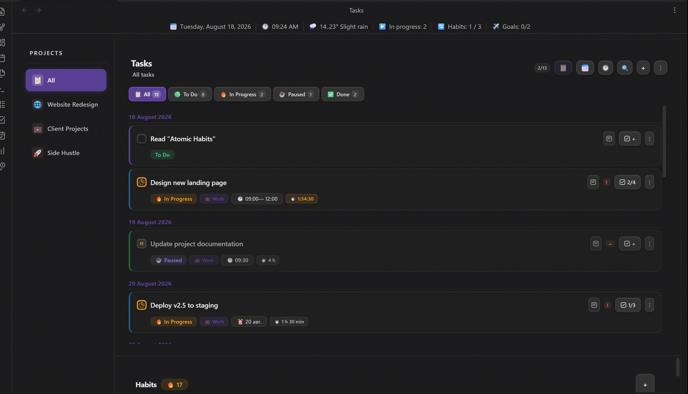
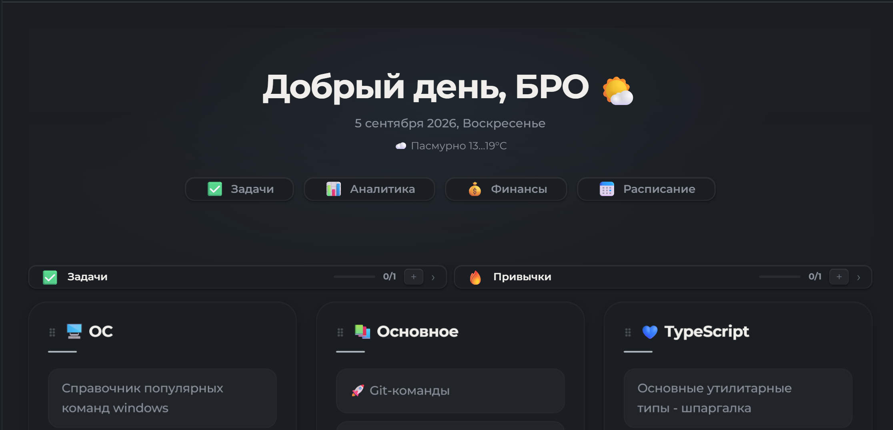

# WorkLife Calendar for Obsidian

> **Forget the chaos.** A smart calendar, task tracker, time tracking, habit control, and finance management — all in one beautiful and connected space.

<div align="center">

[](https://opensource.org/licenses/MIT)
[](https://obsidian.md)
[](https://svelte.dev/)
[](https://www.typescriptlang.org/)


</div>

---



[**Русский README**](README.RU.md)

## 💡 Why This Plugin Exists

Many workflows share the same problem: tasks live in one place, the calendar in another, time tracking in a third, and finances and reports are collected manually in spreadsheets. As a result, the same data has to be entered multiple times.

**This plugin solves exactly that problem.** It doesn't just add another calendar or tracker. It connects planning, execution, and analysis into a single system:
- One task affects the calendar.
- The calendar affects time tracking.
- Time affects income calculation.
- Income generates automatic analytics.

---

## 🚀 Who This Is For

- **Freelancers and developers** who want to automatically calculate the cost of their work by the hour.
- **Students and researchers** who need to keep track of deadlines, projects, and daily habits.
- **Anyone who is tired** of a dozen scattered apps and wants to bring order to a single Obsidian window.


---

## 📦 Installation

### Via BRAT (Recommended)
1. Install the [BRAT](https://github.com/TfTHacker/obsidian42-brat) plugin.
2. Open BRAT settings → **Add Beta Plugin**.
3. Paste the link: `https://github.com/AtinsS/WorkLife-Calendar-for-Obsidian`
4. Click **Add Plugin**.

### Manually
1. Download the archive or clone the repository.
2. Copy `main.js`, `manifest.json`, and `styles.css`.
3. Place them in the `.obsidian/plugins/worklife-calendar/` folder (create it if it doesn't exist).
4. Enable the plugin in *Settings → Community Plugins*.

---

## ☕ Support

If the plugin saves you time and helps in your work, you can support development:
- ⭐ Star the repository.
- [☕ Buy the author a coffee and a bun](https://boosty.to/atins/donate).

---

<details>
<summary><h3>✨ Detailed Features (expand)</h3></summary>

# 📅 Smart Planning
- Understands human language. Just write: tomorrow at 14:00 submit project @Work !urgent, and the plugin will automatically set the date, time, project, and priority.
- Visual calendar (day/week/month) with Drag & Drop support. Drag a task with your mouse to change its time.
- Weather right in the calendar grid, so you can plan things wisely.

# ✅ Focus and Task Management

- Kanban board and lists: 4 statuses (To Do → In Progress → Paused → Done).
- Live timer: start time tracking directly from a task card. The timer won't reset when Obsidian restarts.
- Recurring tasks: configure once, and the plugin will create them daily, weekly, or monthly.

# ⚖️ Balance: Habits and Health

- Habit tracker with progress charts and "streaks."
- Weight control: daily entry, moving average (so you don't get scared by random fluctuations), and a clear chart of progress toward your goal.

# 💰 Finance and Analytics

- Automatic income calculation: the plugin multiplies the time spent on a task by your hourly rate.
- Expense and goal tracking: simple categories with icons and savings progress bars.
- Analytics dashboard: beautiful charts for projects, income, and habits all in one place.

# 🤖 Local AI (Ollama)

- Runs entirely on your computer, without sending data to the internet.
- Can break a large task into a checklist of subtasks or make a brief summary of a long note.

# 🔔 Notifications That Won't Let You Oversleep

- Desktop reminders N minutes before the start.
- Duplication to your phone (via ntfy.sh), so you know about a deadline even if Obsidian is closed.

</details>

<details>
<summary><h3>🔗 Sync and Integrations (expand)</h3></summary>

### New Data Storage Format
The plugin stores data in JSON format in the `calendar-data/` folder at the root of the vault. When the "Sync to vault root" feature is enabled, it becomes the primary data storage format, providing fast loading and data synchronization via:
- **WebDAV** (Yandex.Disk, OneDrive, etc.)
- **Obsidian Sync** / **Remotely Save**
- **iCloud** / **Google Drive**
- **Syncthing***


> [!WARNING] Financial Data
> If you track finances in the plugin and use cloud synchronization, income and expense data will be stored in plain text in the cloud. It is recommended to use abstract project names or exclude the `calendar-data/` folder from synchronization.

### External Calendars (Git sync required)
1. Create a [GitHub Personal Access Token](https://github.com/settings/tokens) (classic) with the `gist` scope.
2. Paste the token into the plugin settings and click **"Sync"**.
3. The plugin will create a Gist with an `.ics` file and provide a link.
4. Add this link to your calendar via the "Subscribe by URL" function.

### Tasks Format Integration (optional)
When the "Tasks plugin sync" setting is enabled, the plugin creates `.md` files for tasks so they are visible in the Tasks and Dataview plugins. This is an **additional** feature — the primary storage remains in JSON. Example of a generated file:
```markdown
---
task_id: abc123
title: Buy milk
status: todo
date: day-2024-10-25
priority: medium
---
- [ ] Buy milk 📅 2024-10-25 🛫 14:30 🔼
```
*(Supported statuses: `- [ ]` todo, `- [/]` progress, `- [-]` paused, `- [x]` done)*

> [!NOTE]
> Optional synchronization with `.md` files (via the "Tasks plugin sync" setting) is intended for compatibility with the [Tasks](https://github.com/obsidian-tasks-group/obsidian-tasks) and [Dataview](https://github.com/blacksmithgu/obsidian-dataview) plugins.

</details>

<details>
<summary><h3>🔔 Notifications (expand)</h3></summary>

The plugin has a built-in notification system so you don't miss anything important.

| Type | When It Triggers |
| :--- | :--- |
| **Local (browser)** | N minutes before the start, when overdue, when the time limit is exceeded, on the deadline day. |
| **To smartphone (ntfy.sh)** | Duplication of notifications to your phone. Works even when Obsidian is closed. |

### Setting Up ntfy.sh

An easy way to receive notifications on your phone:
1. Install the [ntfy.sh](https://ntfy.sh/) app on your phone.
2. In the plugin settings, enable **ntfy.sh** and set a topic.
3. Subscribe to that topic in the app.

> [!CAUTION] Security
> Use a unique topic (e.g., a generated UUID like `a7f9b2c4-8e1d-4f3a-9c5b-2d6e8f0a1b3c`) so no one else can subscribe to your notifications. The plugin only sends triggers ("Overdue: Task Name"), not financial data or full texts.

</details>

<details>
<summary><h3>🧭 UI Widgets in Notes (expand)</h3></summary>

Insert a code block into any note to create a quick navigation panel for the plugin's sections:

````markdown
```calendar-nav
schedule:Schedule
tasks:Tasks
finance:Finance
analytics:Analytics
```
````
Available keys: `schedule`, `tasks`, `finance`, `analytics`.

**Style customization** (first line starts with `%`):
````markdown
```calendar-nav
%color:#fff;bg:#333;radius:20px;size:14px;accent:#5f99e1
schedule:Schedule
tasks:Tasks
```
````
Style parameters: `color` (text), `bg` (background), `radius` (corner rounding), `size` (font size), `accent` (hover color).

### Dashboard and Greeting

Right-click on a page and select "Add Dashboard" or "Insert Greeting" to create a new dashboard or greeting on the page.


In the greeting, you can show quick weight entry and note search — both toggled in *Dashboard → Greeting Buttons*.
Dashboard widgets (tasks / habits / goals) are configured in *Dashboard → Dashboard Widgets*.

</details>

---

## 🐛 Issues and Bug Reports

Found a bug or have a feature suggestion? Open an issue on GitHub:

**[Open Issue](https://github.com/AtinsS/WorkLife-Calendar-for-Obsidian/issues)**

When reporting a bug, please include:
- Obsidian version
- Plugin version
- Steps to reproduce
- Expected and actual behavior
- Console errors (if any): *Ctrl+Shift+I → Console tab*

---

## Credits and License

This project is based on [obsidian-calendar-plugin](https://github.com/liamcain/obsidian-calendar-plugin) by [Liam Cain](https://github.com/liamcain) (MIT) and significantly extended.

Third-party libraries included in `main.js` are listed in [THIRD_PARTY_NOTICES.md](THIRD_PARTY_NOTICES.md).

<div align="center">
  <sub>Developed with attention to detail for the Obsidian community</sub><br>
  <sub>Author: <a href="https://github.com/AtinsS">@AtinsS</a></sub><br>
  <sub>License: <a href="https://opensource.org/licenses/MIT">MIT</a></sub>
</div>